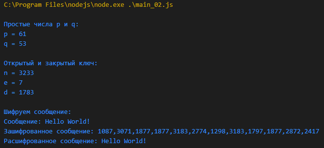
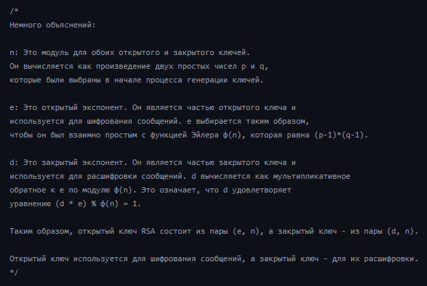
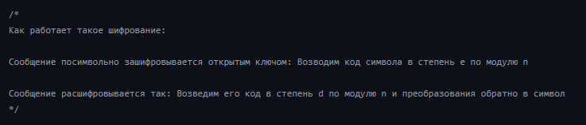

Это учебный проект, в котором мне нужно было реализовать алгоритм RSA шифрования, без использования библиотек

Сообщение шифруется посимвольно, сохраняя код каждой отдельной буквы, и когда рашифровывается - символы складываются обратно в строку

